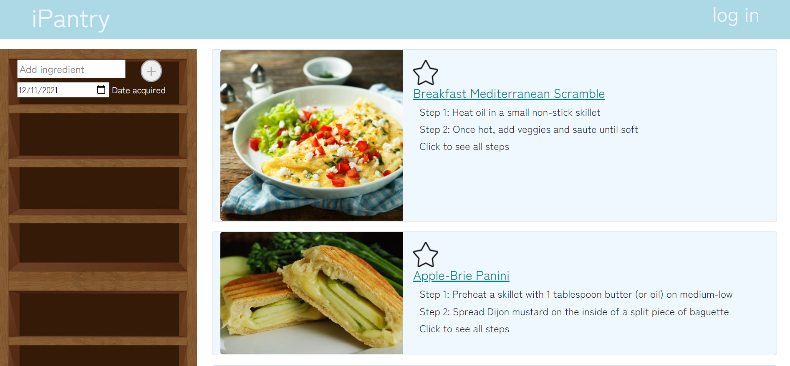
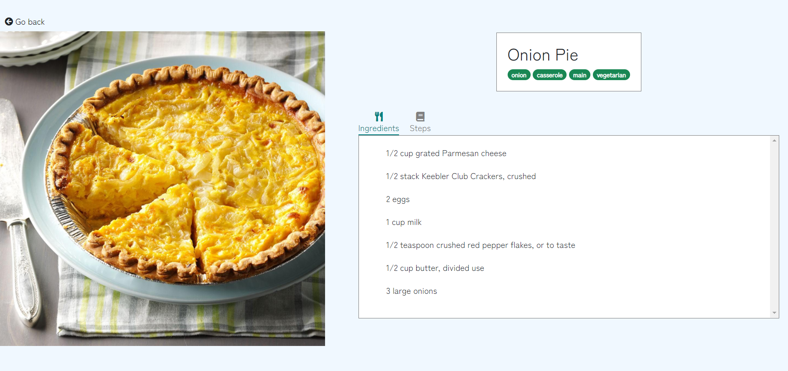
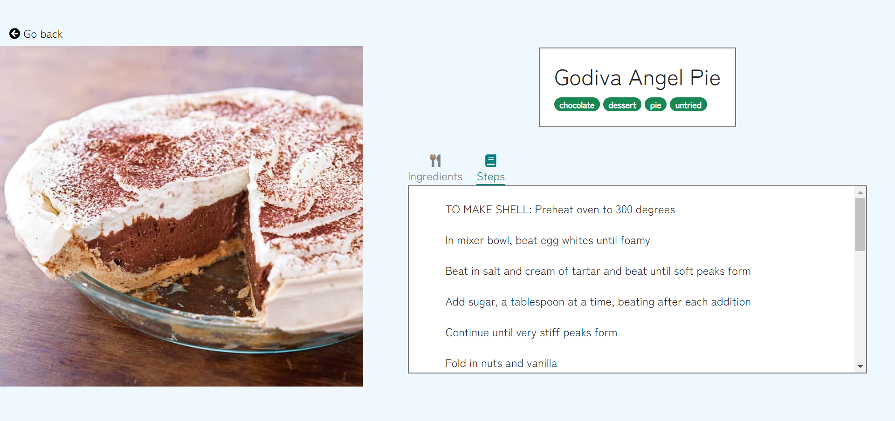

# Team Pi
## iPantry

Semester: Fall 2021

# Overview 

Our application allows users to specify ingredients in a virtual pantry, called iPantry. The application will automatically find recipes with all ingredients currently in the iPantry (and automatically excluding old ingredients) so users can quickly find recipes that use food they already have on hand. This innovative application allows you to specify the date you acquired an ingredient, and will automatically detect whether it can still be used, or if it is expired.

# Team Members

Alex Agoos (aagoos)

Megan Lew (lewmeg)

# User Interface

Image of the home page.

Users can add ingredients by filling in the textbox and optionally choosing a date. Clicking the (+) icon will add the ingredient. Clicking the small + icon will instead update the selected ingredient with the current name and date values.


Image of the recipe page, ingredient tab selected. The user can read the ingredients needed for the recipe while the ingredient tab is selected.




Image of the recipe page, steps tab selected. The user see all steps required to make their recipe. They can also quickly switch tabs to view the required ingredients at any time. 



# API


## /lookup
Returns the recipe for a specified ID.

Example GET request: `curl localhost:8080/lookup?id=0`
Example response: 
```json
{
    "id":0,
    "title":"ham + cheese = genius?",
    "ingredients":["ham","cheese","bread"],
    "steps":
    [
        "put da ham on da bread",
        "put da cheese on the ham and bread",
        "close ur sammich with more breadz"
    ],
    "tags":["dairy","wheat","gluten"]
}
```

## /recipes GET
Returns the all the recipes which match the query. The query uses the mongoDB syntax. Use double quotes.

Example GET request: `curl localhost:8080/recipes?search={"id":15}`
Example response: 
```json
{
    [
        {
            "_id":"61983f821023b78cdcec11bb",
            "id":15,
            "title":"Spicy Rice Casserole",
            "steps":[
                "Preheat oven to 425 degrees","Mix rice, oats, onion, bread crumbs, milk, basil, oregano, cayenne, and egg","  Press mixture into small baking dish","  Mix panko and parmesan, put on top of mixture","  Bake for 20 minutes or until crispy or browned","  (If topping starts browning too soon, cover loosely with aluminum foil",")Serve with marinara sauce"
            ],
            "ingredients":[
                "2 cup cooked rice","1/2 cup quick-cooking oats","1/2 cup onion, chopped","1/4 cup panko","1/4 cup milk","1 tbsp italian seasoning","1/8 tsp cayenne pepper","1 large egg, beaten","1/2 cup panko","1/4 cup parmesan cheese","4 serving [marinara sauce](http://www.xanthir.com/recipes/showrecipe.php?id=id34)"
            ],
            "tags":["vegetarian","rice","main"]
        }
    ]
}
```

## /recipes POST
Adds a new recipe to the database. Does nothing if a recipe with that ID already exists (compare: /recipes PUT)

Example POST request: `curl -d '{"id": 10, "title": ham, "ingredients":["ham"], "steps":["eat"], "tags":[]}' -H 'Content-Type: application/json' -X POST localhost:8080/recipes`

Example response: 
HTTP 200: OK

## /recipes PUT
Adds a new recipe to the database. Replaces an existing recipe with the same ID, should one exist (compare: /recipes POST)

Example PUT request: `curl -d '{"id": 10, "title": ham, "ingredients":["ham"], "steps":["eat"], "tags":[]}' -H 'Content-Type: application/json' -X PUT localhost:8080/recipes`

Example response: 
HTTP 200: OK

## /recipes DELETE
Deletes a recipe with the given ID from the database. Does nothing if no recipe has the given ID.

Example DELETE request: `curl -d '{"id": 5}' -H 'Content-Type: application/json' -X DELETE localhost:8080/recipes`

Example response: 
HTTP 200: OK
