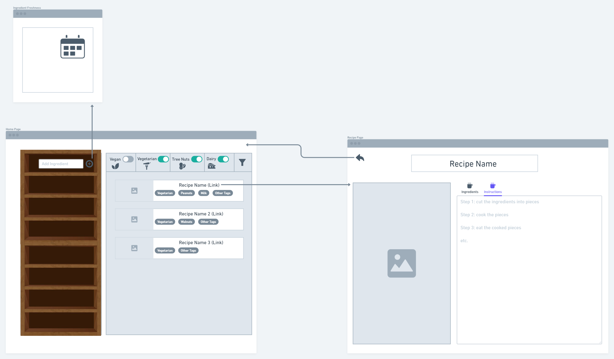
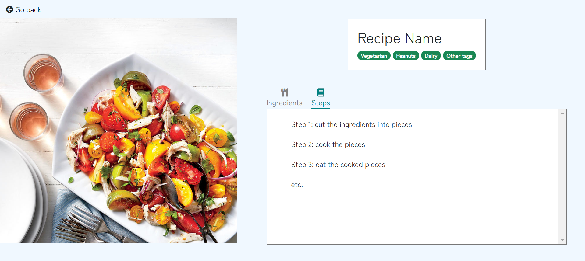

# Part 1: Wireframes

  

# Part 2: HTML and CSS

# Part 3: Division of Labor

Adrianna: Wrote HTML and CSS for the ingredient list on the homepage, combined all home page elements and added title bar, made aesthetic changes of color and font for cohesion between recipe page and home page, gave feedback on wireframes and added interaction for date selection to wireframe  
  
Alex: Created base wireframe, structured initial HTML document to facillitate division of work, wrote HTML and CSS for recipe filtering and display on the home page  
  
Megan: Generated design and layout ideas, improved design and layout on wireframe, wrote HTML and CSS for recipe page  