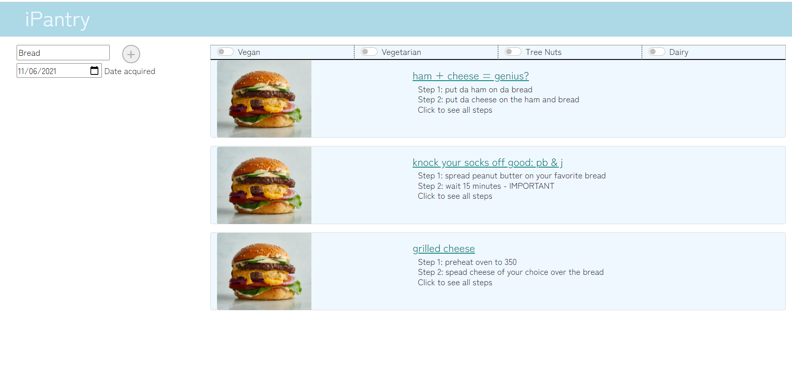
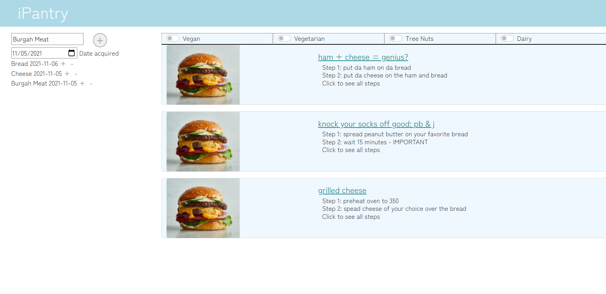
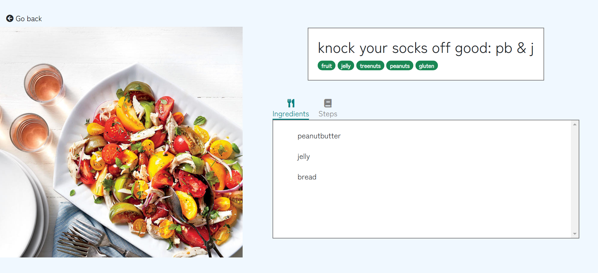
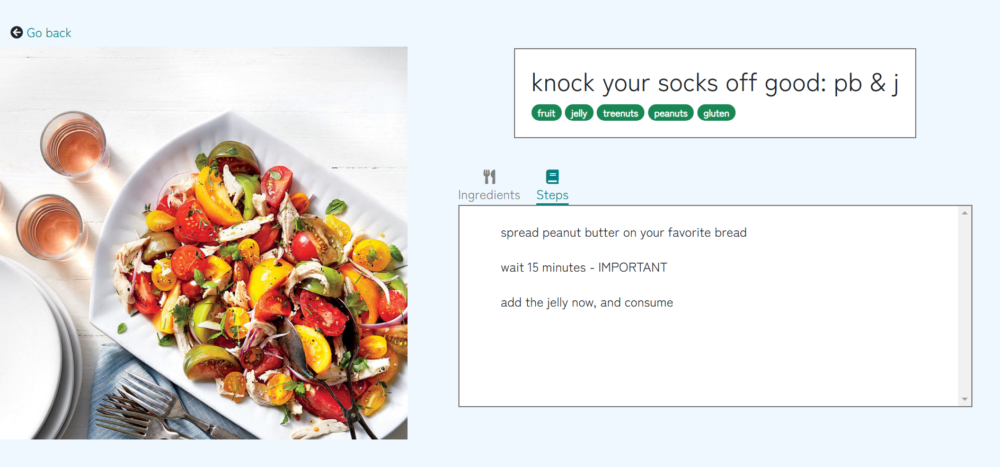

# API Planning


## /lookup
Returns the recipe for a specified ID.

Example GET request: `curl localhost:8080/lookup?id=0`
Example response: 
```json
{
    "id":0,
    "title":"ham + cheese = genius?",
    "ingredients":["ham","cheese","bread"],
    "steps":
    [
        "put da ham on da bread",
        "put da cheese on the ham and bread",
        "close ur sammich with more breadz"
    ],
    "tags":["dairy","wheat","gluten"]
}
```

## /recipes GET
Returns the all the recipes which match the query. The query uses the mongoDB syntax. Use double quotes.

Example GET request: `curl localhost:8080/recipes?search={"id":15}`
Example response: 
```json
{
    [
        {
            "_id":"61983f821023b78cdcec11bb",
            "id":15,
            "title":"Spicy Rice Casserole",
            "steps":[
                "Preheat oven to 425 degrees","Mix rice, oats, onion, bread crumbs, milk, basil, oregano, cayenne, and egg","  Press mixture into small baking dish","  Mix panko and parmesan, put on top of mixture","  Bake for 20 minutes or until crispy or browned","  (If topping starts browning too soon, cover loosely with aluminum foil",")Serve with marinara sauce"
            ],
            "ingredients":[
                "2 cup cooked rice","1/2 cup quick-cooking oats","1/2 cup onion, chopped","1/4 cup panko","1/4 cup milk","1 tbsp italian seasoning","1/8 tsp cayenne pepper","1 large egg, beaten","1/2 cup panko","1/4 cup parmesan cheese","4 serving [marinara sauce](http://www.xanthir.com/recipes/showrecipe.php?id=id34)"
            ],
            "tags":["vegetarian","rice","main"]
        }
    ]
}
```

## /recipes POST
Adds a new recipe to the database. Does nothing if a recipe with that ID already exists (compare: /recipes PUT)

Example POST request: `curl -d '{"id": 10, "title": ham, "ingredients":["ham"], "steps":["eat"], "tags":[]}' -H 'Content-Type: application/json' -X POST localhost:8080/recipes`

Example response: 
HTTP 200: OK

## /recipes PUT
Adds a new recipe to the database. Replaces an existing recipe with the same ID, should one exist (compare: /recipes POST)

Example PUT request: `curl -d '{"id": 10, "title": ham, "ingredients":["ham"], "steps":["eat"], "tags":[]}' -H 'Content-Type: application/json' -X PUT localhost:8080/recipes`

Example response: 
HTTP 200: OK

## /recipes DELETE
Deletes a recipe with the given ID from the database. Does nothing if no recipe has the given ID.

Example DELETE request: `curl -d '{"id": 5}' -H 'Content-Type: application/json' -X DELETE localhost:8080/recipes`

Example response: 
HTTP 200: OK

# Screenshots

Home page: type ingredient and select + to add


Home page: after adding. Clicking - deletes the ingredient. Clicking the small + updates the entry with current values.


Recipe page: tab showing ingredients


Recipe page: tab showing steps



# Heroku URL

https://cs326-final-team-pi.herokuapp.com/

# Division of Labor

Adrianna: Wrote populateRecipes in index.js, wrote put in server.js 

Alex:  Wrote database.js shell, wrote framework and recipes GET and lookup GET and recipes POST. Implemented code for buttons for adding/updating/dating ingredients in index.js, wrote testdata.json, setup heroku, changed index.js to make a get request instead of const data.

Megan:  Wrote front-end implementation for recipe page in recipe.js, made changes to recipe.html and recipestyle.css and wrote delete in server.js